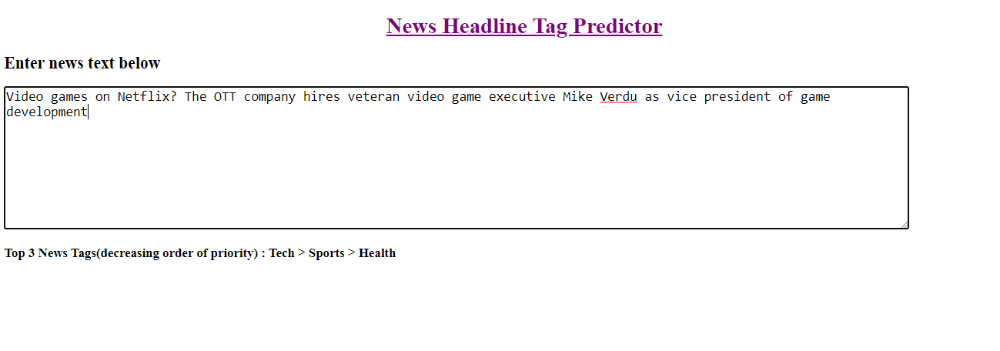

## News Headline Tag Predictor 

#### Deployment 

- In this project I have created a neural network to predict the tag of a news headline.
- Here I have used 6 TAGS `world`, `tech`, `sports`, `india`, `health`, `entertainment`.
- Model accuracy on `training` data is in range 0.87-0.93
- Model accuracy on `testing`  data is in range 0.85-0.88 

#### Model Performance :

## Usage 

- Open `Git Bash` 
- Go to the directory where you want to clone the repository by using `cd` command.
- Type `git clone  git clone https://github.com/kumar-mahendra/ML-Projects/tree/main/News_headline_tag_predictor`
- press  `Enter` to create a local clone.

- Now open the repo in your IDE and run `app.py` file. 
- Thats it . Now app is running on  http://127.0.0.1:8050/ 

 
